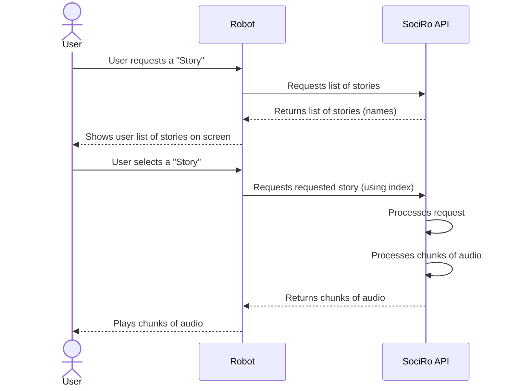

## User Request Example

```mermaid
sequenceDiagram
    actor User
    participant Robot
    participant SociRo API

    User->>Robot: User requests a "Story"
    Robot->>SociRo API: Requests list of stories

    SociRo API-->>Robot: Returns list of stories (names)
    Robot-->>User: Shows user list of stories on screen

    User->>Robot: User selects a "Story"
    Robot->>SociRo API: Requests requested story (using index)
    SociRo API->>SociRo API: Processes request
    SociRo API->>SociRo API: Processes chunks of audio
    SociRo API-->>Robot: Returns chunks of audio
    Robot-->>User: Plays chunks of audio
```
